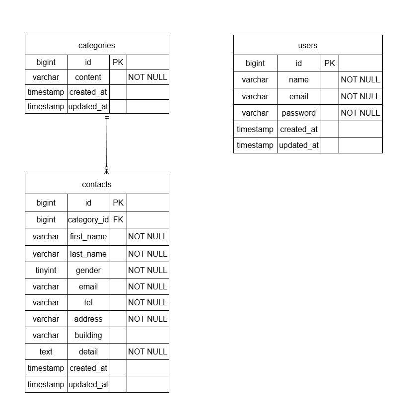

# お問い合わせフォーム

## 環境構築

### Dockerビルド

- git clone git@github.com:yakhrc5/test_contact-form.git
- cd test_contact-form
- docker-compose up -d --build

### Laravel環境構築

- docker-compose exec php bash
- composer install
- cp .env.example .env (環境変数を適宜変更)
- php artisan key:generate
- php artisan migrate
- php artisan db:seed

## 開発環境

- お問い合わせ画面: http://localhost/
- ユーザー登録: http://localhost/register
- phpMyAdmin: http://localhost:8080/

## 使用技術（実行環境）

- PHP 8.1.34
- Laravel 8.83.29
- MySQL 8.0.26
- nginx 1.21.1
- JavaScript（Vanilla JS）
- Docker / Docker Compose
- HTML / CSS（Bladeテンプレート）

## ER図

